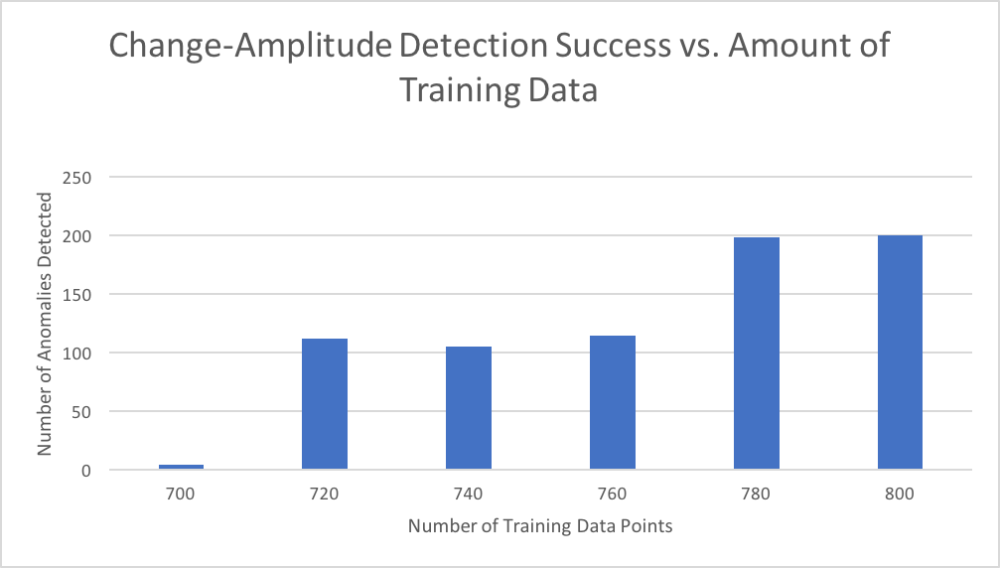
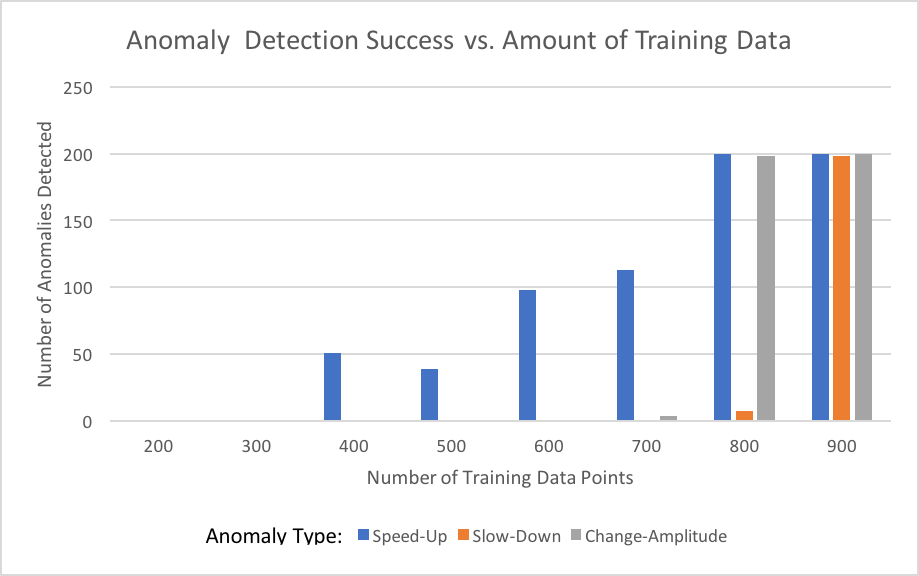
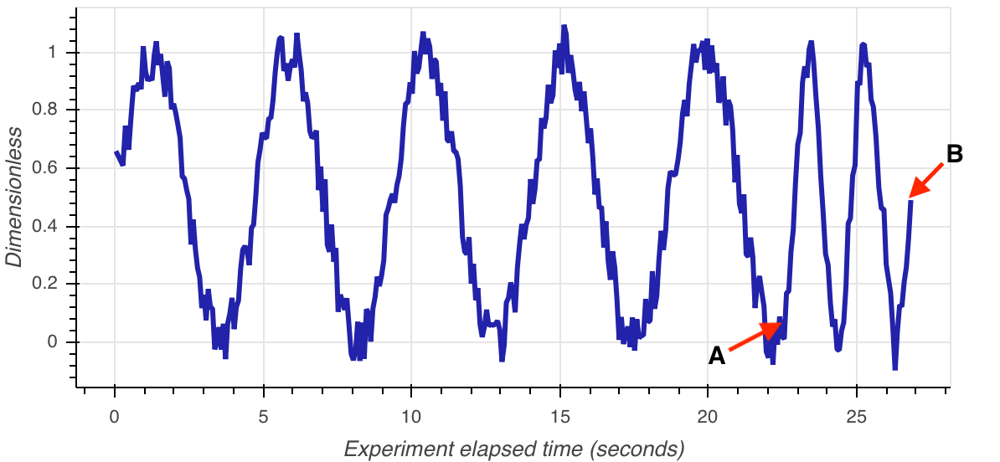

# Introduction

Laboratory-scale chemical synthesis has largely been done by hand since the time of alchemy.
Experimental reproducibility is harmed by this paradigm both because individual experimenters may not perform the same experiment precisely the same way each time and because imprecision in the communication of the experimental protocol between researchers may result in different results.
However, automating and scaling these types of experiments is a challenge in part because it is still not a trivial task to design, assemble, and reliably control a set of computerized laboratory equipment to execute specific task.

Continuous-flow experimentation is an alternative approach to chemical synthesis in which reactions occur continuously as the reagents are pumped together.
Thus, every step of the reaction is occurring at the same time.
Continuous-flow systems have been used for the synthesis of biomolecules [@Mijalis2017], pharmaceuticals [@Kitson2018], and fragarences [@Morin2019].
This type of experiment lends itself more readily to automation than step-by-step batch synthesis, but the ability to simultaneously control and monitor the pumps, sensors, heaters, and other components is still an open problem.

MechWolf is a Python package that aims to solve this proven by integrating chemical process design, analysis, and execution for both continuous-flow and batch experiments [@acs2018].
Often run on low-cost, highly constrained systems, such Raspberry Pis, MechWolf also enables chemists around the world to automatically collect data as their experiment executes and remotely monitor the experiment's progress.
A key aspect of the automated execution feature is that, in the event of an error, the system shuts down immediately.
However, due to hardware limitations, failures often do not raise errors and false positives are frequent.
Due to the reactive nature of the chemicals involved, undetected failures also pose a safety concern.

Therefore, it is important that MechWolf be able to monitor sensor data in real time to identify uncommanded changes to the system's state indictable of a failure.
Furthermore, this system must be able to work on devices without an internet connection and with extremely limited memory availability.
Because all flow-based robotic chemistry systems depend on one or more pumps to move liquids and the high failure rate of the pumps used in these systems, we identified autonomous pump monitoring as key feature to enable safer experimentation.

# Related work

There are several frameworks for robotic chemistry.
However, to the best of our knowledge there have not been any attempts to perform on-device learning in real time to detect anomalies.
Neither the Chemputer [@Kitson2018] nor Octopus [@octopus] have implemented anomaly detection of any kind.

There are several methods for time series anomaly detection, although only a subset of them are capable of being computed in real time on streamlining data.
One such method is the neuro-inspired hierarchical temporal memory (HTM) method, developed by Numenta to resemble the neocortex [@Ahmad2017].

# Methods

Because the pumps use in chemical systems generate sinusoidal waves when monitored by UV/visible light spectroscopy sensors, we focused on identifying anomalies with the waveforms present in the sensor data.
Since the devices have limited compute and memory capacity, we decided to use a recently published unsupervised tree-based method, the robust random cut forest (RRCF) for anomaly detection on the data streams [@rrcf].
RRCF enables us to precisely control the amount of memory used for anomaly detection to ensure that sufficient memory is available for MechWolf.
We eliminated threshold-based methods as too simple to capture the types of anomalies common to pumps in chemical systems. Similarly, we eliminated any models which were customized for a specific pump type due to the wide variety of pumps in use among MechWolf's users. Thus, we required a computationally efficient, fully unsupervised model capable of performing anomaly detection on streams of sinusoidal .

The source code for our methods is available online at [github.com/MechWolf/MechWolf/tree/CS249](https://github.com/MechWolf/MechWolf/tree/CS249).

## Robust Random Cut Forest

Soumil will write up a description of how RRCF works here.

To recall, our central  goal is to develop a method to detect anomalies in sensor reading data. We experiment on multiple types of anomalies including speed-up, slow-down, and change-amplitude anomalies, and aim to deploy a generic model which can catch all of these types. With this motivation, we employed the use of the Robust Random Cut Forest model, a machine learning model which we define below.

In essence, a Robust Random Cut Forest is a collection of independent Robust Random Cut Trees. RRCT is a recursively defined tree data structure where each node corresponds to a subset $S'$ of the total point set $S$. 

Definition 1.1 - Robust Random Cut Tree: a RRCT is defined on a set of points $S$, where points each have dimension $d$. Let $l_i = max_{x \in S}x_i - min_{x \in S}x_i, \forall i$ and let $p_i = \frac{l_i}{\sum_{j}l_j}$. We now select a random dimension $k \in \{1....d\}$ with probability proportional to $p_k$, and define the random variable $X_k$ ~ $Uniform[min_{x \in S}x_k, max_{x \in S}x_k]$. We now define our two children nodes corresponding to sets $S_1$ and $S_2$ such that  $S_1 = \{x|x \in S, x_k \leq X_k\}$, and $S_2 = S \backslash S_1$.  We then recurse on the two children corresponding to $S_1,S_2$ until either set corresponds to a singleton set, or the empty set (base case).

Definition 1.1 defines RRCT on a set of points $S$, however, in the case of streaming signal data points are continuously added to the set $S$, and hence must be dynamically added to the RRCT. Hence RRCTs allow for both insertion and deletion operations. That is, if we dynamically add a point $p$ to $S$, we have a function $insert(p)$ which takes as input $RRCT(S)$ and returns $RRCT(S \cup p)$ -  (detele is analogously defined). 

We omit the formal definition of these functions but provide high level intuition for the insertion operation. When inserting a point p into the tree, we generate a new random cut along some random dimension, and then check if this cut separates point $p$ from set $S$. If it does, then we construct a parent node $k$ and specify that the two children of $k$ are the node corresponding to the point $p$ and the node corresponding $S$ (which is of course the root of the original tree). If the cut does not separate $S$ and $p$, we follow the existing cut and under the same process and recurse on either child of the current node until we have correctly isolated $p$ as a leaf node. Deletions are more simple; we simply remove the leaf node corresponding to $p$ from the tree, removing $p's$ parent, and then adding an edge between $p's$ sibling node to its grandparent node. 

We now need to formalize the definition of an anomaly in the context of RRCT/RRCF. We introduce the notion of the model complexity $M$ of a RRCT. If an RRCT $T$ is defined on a set $S$, let the depth of point $y \in S$  in the tree be given by the function $f(y, S, T)$. Now, the model complexity is given as follows $M(T) = \sum_{y \in S}f(y,S,T)$. Now, we wish to determine whether or not point $x$ is an anomaly, and we do so by measuring the change in model complexity induced by the removal of $x$, which is proportional to $\sum_{y \in S}f(y,S,T) - \sum_{y \in S - x}f(y,S - x,T')$. Remembering however that the generation of $T$ follows a random process and the mapping of $T(S)$ to $T(S - x)$ is many to one, we take the sum over the probability distribution of obtaining tree T and define the quantity bit-displacement as $BDisp(x, S) = \sum_{T, y \in S}Pr(T)(f(y,S,T) - f(y,S - x,T'))$. 

$BDisp$ is one of many possible measures of anomalies. The measure our experiments used was Co-Disp which is similar to $BDisp$, but less instructive in this explanation and hence not detailed here. Intuitively, when we are evaluating whether or not point $x$ is an anomaly using $BDisp$, it is clear that we are more likely to achieve a higher $BDisp$ the shallower $x$ is as a leaf node in the tree. This is because the shallower $x$ is, the more nodes its sibling node $x'$ will tend to have in its subtree, and hence the more nodes will have their depth reduced upon the deletion of $x$ from the tree. This is a desireable property because our definition of RRCT means that anomaly points are likely to be isolated at shallower depths in the tree. To see why, consider the world in which cuts/partitions are made entirely randomly; clearly anomalous points should be isolated before other points in general. As it happens, under our definiton of RRCT, we are more likely to make cuts along dimensions which contain anomalous data and are even more likely than a completely uniformly random process to isolate anomalous points quickly, and hence in our RRCT anomalous points will tend to correspond to shallower leaf nodes. 

To generalize to a Random Robust Cut Forest is relatively straightforward. If an RRCF was comprised of $y$ RRCTs, then to evaluate the anomaly score for a point $x$, one can easily design an algorithm which instead of analytically summing over the entire probability distribution over RRCTs simply calculates the change in model complexity for each of the $y$ RRCTs when $x$ is removed from each of them, and then average them. The designer would then specify some threshold which if this average value exceeded would mean $x$ is classified as an anomaly. 

## Model Evaluation

To study the performance of the RRCF model, we extended MechWolf by creating a virtual sensor capable of returning simulated data indicative of various known failure modalities: uncommanded increases in pump frequency, uncommanded decreases in pump frequency, and incomplete pump actuation resulting in a decrease in amplitude.
This virtual sensor inserts noise into the output data stream in order to simulate noise in the spectroscopy reading.

In order to perform peak prominence and width finding on sensor data to use as features for the RRCF model, we relied on SciPy's signal processing routines [@scipy].
Similarly, to smooth the data, we used a moving average with a window size of 11 as implemented by SciPy [@scipy-cookbook].

We used the RRCF implementation in @Bartos2019 to calculate the collusive displacement of each datapoint in the stream.
To identify collusive displacement values that are indicative of an anomaly, we performed thresholding for values greater than 20 and more than two standard deviations from the mean collusive displacement.

## Real-Time Implementation

For the real time monitoring capability, we intend to create a Flask local web server to run as a separate process on the device.
We have already modified the MechWolf `Sensor` object (which is responsible for reading data) to immediately post an asynchronous request to this server upon the receipt of new data.
The server will perform peak-finding and compute the anomaly score via RRCF.
If an anomaly is detected, it will return an error, which will be propagated by the `Sensor` object to the MechWolf protocol executor, which will in turn halt the experiment if configured to do so by the user.

# Results

## Model Evaluation

We are doing this now.

### Featurization achieves better results faster.

We tested RRCF on the raw data and the

### RRCF can identify major anomalies with very little training data.

Because the sinusoidal waves in the signal from spectrographs are highly regular, minimal training data is required to identify anomalous pump actuation.

## Real-Time Performance

We have not done this yet.

# Conclusion

 <!-- leave this at the bottom because it writes the references at the end-->

# References
