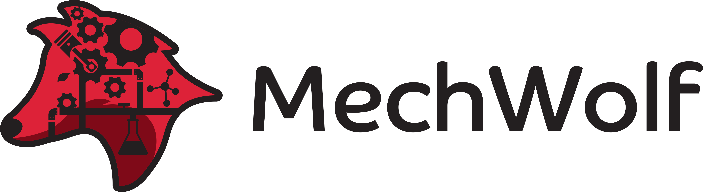

.. MechWolf documentation master file, created by
   sphinx-quickstart on Mon Mar  5 19:32:31 2018.
   You can adapt this file completely to your liking, but it should at least
   contain the root `toctree` directive.

MechWolf: Continuous Flow Process Description, Analysis, and Automation
=======================================================================

MechWolf is a Python framework for automating continuous flow processes. It was
developed as a collaboration between computer scientists, chemists, and complete
novices to be used by anyone wanting to do better, faster, more reproducible
science, from undergraduates with no experience to tenured professors at the top
of their fields. Features include:

- Natural language description, analysis, and visualization of continuous flow networks
- Automated execution of protocols via the Internet of Things
- Full user extensibility
- Smart default settings, designed by scientists for scientists
- Extensive checking to prevent potentially costly and dangerous errors *before* runtime
- Natural language parsing of times and quantities
- Thorough documentation and tutorials

What does "MechWolf" even mean?
-------------------------------

Simply, "MechWolf" is an anagram of "flow chem". This tool can do so much more
than just chemistry automation, so we decided not to pigeonhole ourselves by
calling the project "flow chem".  We like to think MechWolf is a **way** cooler
name anyway.

Three Minutes to MechWolf
-------------------------

Let's say you're trying to automate the production of `acetaminophen
<https://en.wikipedia.org/wiki/Paracetamol>`_, a popular pain reliever and fever
reducer. The reaction involves combining two chemicals, 4-aminophenol and acetic
anhydride. The basic level of organization in MechWolf are individual
components, such as the vessels and pumps. Let's go ahead and create them::

    import mechwolf as mw

    # define the vessels
    vessel_1 = mw.Vessel("10 mL `4-aminophenol`")
    vessel_2 = mw.Vessel("10 mL `acetic anhydride`")
    vessel_3 = mw.Vessel("`acetaminophen`")

    # define the pumps
    pump_1 = mw.Pump(name="pump_1")
    pump_2 = mw.Pump(name="pump_2")

    # define the mixer
    mixer = mw.TMixer()

That wasn't too bad! Just as putting vessels and pumps on a lab bench doesn't
actually do anything, we're going to need to tell MechWolf what the
configuration of the components is. The :literal:`\`` symbols are there to
surround chemical names that we want resolved; we'll see how that works shortly.

We can do this by creating an :class:`~mechwolf.Apparatus` object. To add connections between
components, we need to tell MechWolf three things: where the connection is from,
where it's going, and how they are actually connected. Tubing type can have a
significant effect on reproducibility, so we require that you explicitly specify
what tubing you are using when connecting components. This sounds complicated,
but it is actually easy in practice::

    # same tube specs for all tubes
    tube = mw.Tube(
        length="1 m",
        ID="1/16 in",
        OD="2/16 in",
        material="PVC")

    # create the Apparatus object
    A = mw.Apparatus()

    # add the connections
    A.add(vessel_1, pump_1, tube)
    A.add(vessel_2, pump_2, tube)
    A.add([pump_1, pump_2], mixer, tube)
    A.add(mixer, vessel_3, tube)

With the :class:`~mechwolf.Apparatus` object, we can do *so* much. If we call
:meth:`~mechwolf.Apparatus.summarize()`, we'll get a clean tabular describe of
our apparatus like this with summary values automatically computed:

.. image:: /_static/example_table.png
    :align: center

But wait, there's more! :meth:`~mechwolf.Apparatus.visualize()` will create a
diagram of the network:

.. image:: /_static/example_apparatus_with_labels.png
    :align: center

It's fully customizable, so you can decide whether to show the details of the
tubing, the name of the apparatus, and more. And that's not all either.
:meth:`~mechwolf.Apparatus.describe()` will generate an SI-ready description of
the apparatus:

.. code-block:: text

    A vessel containing 10 mL 4-aminophenol was connected to Pump pump_1 using
    PVC tubing (length 1 meter, ID 0.0625 inch, OD 0.125 inch). A vessel
    containing 10 mL acetic anhydride (Acetyl acetate) was connected to Pump
    pump_2 using PVC tubing (length 1 meter, ID 0.0625 inch, OD 0.125 inch).
    Pump pump_1 was connected to TMixer TMixer_0 using PVC tubing (length 1
    meter, ID 0.0625 inch, OD 0.125 inch). Pump pump_2 was connected to TMixer
    TMixer_0 using PVC tubing (length 1 meter, ID 0.0625 inch, OD 0.125 inch).
    TMixer TMixer_0 was connected to a vessel containing acetaminophen
    (N-(4-Hydroxyphenyl)acetamide) using PVC tubing (length 1 meter, ID 0.0625
    inch, OD 0.125 inch).

Note that chemical names were automatically resolved to their IUPAC names.
That's because the :literal:`\`` s around the chemical name tell MechWolf to use
`the National Cancer Institute's resolver
<https://cactus.nci.nih.gov/chemical/structure>`_.

Now that we've gone over how to define an apparatus and all the different ways
to inspect it, let's make it synthesize acetaminophen. We do that with a
:class:`~mechwolf.Protocol`, a list of procedures defined for an
:class:`~mechwolf.Apparatus`. For this reaction, it's as simple as deciding the
flow rate and duration for which to run the pumps::

    # create the Protocol object
    P = mw.Protocol(A, name="acetaminophen synthesis")

    # add the procedure for the pumps
    P.add([pump_1, pump_2], duration="10 mins", rate="1 mL/min")

It's really that simple to create protocols. We can visualize it equally simply
with :meth:`~mechwolf.Protocol.visualize()`:

.. image:: /_static/example_gantt.png
    :align: center

Since we have a good idea of what our protocol is going to do, let's go ahead
and compile it. This will convert the procedure we added to the protocol into a
list of instructions that can be passed to the components. We can compile it
directly with :meth:`~mechwolf.Protocol.compile()` but let's get it in `YAML
format <https://en.wikipedia.org/wiki/YAML>`_ for the sake of readability by
calling :meth:`~mechwolf.Protocol.yaml()`:

.. code-block:: yaml

    pump_1:
    - params: {rate: 1 mL/min}
      time: 0.0
    - params: {rate: 0 ml/min}
      time: 600.0
    pump_2:
    - params: {rate: 1 mL/min}
      time: 0.0
    - params: {rate: 0 ml/min}
      time: 600.0

Just as we expect, the pumps will both turn on to 1 mL/min at time 0 and turn
off 600 seconds (10 minutes) later. When we're ready to actually execute the
protocol, we just call :meth:`~mechwolf.Protocol.execute()` and MechWolf will do
the rest, ensuring that both pumps have their protocols and start in sync.

About
-----
.. toctree::
   :maxdepth: 1

   about/why
   about/faq
   about/security

User Guide
----------
.. toctree::
   :maxdepth: 2

   guide/gentle_intro
   guide/installation
   guide/getting_started
   guide/new_components

API Reference
-------------
.. toctree::
   :maxdepth: 2

   mechwolf
   mechwolf.components

Indices and tables
------------------

* :ref:`genindex`
* :ref:`modindex`
* :ref:`search`
