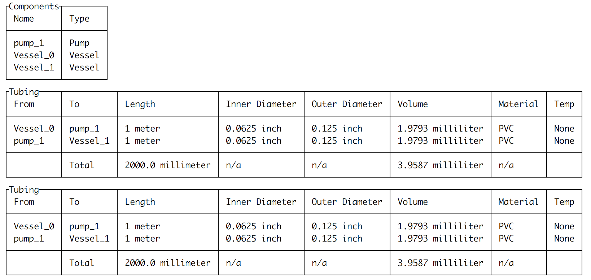

.. MechWolf documentation master file, created by
   sphinx-quickstart on Mon Mar  5 19:32:31 2018.
   You can adapt this file completely to your liking, but it should at least
   contain the root `toctree` directive.

MechWolf: Continuous Flow Process Description, Analysis, and Automation
=======================================================================

.. image:: ../../logo/wordmark10x.png
    :width: 490px
    :align: center
    :height: 135px

MechWolf is a Python framework for automating continuous flow processes. It was
developed as a collaboration between computer scientists, chemists, and complete
novices to be used by anyone wanting to do better, faster, more reproducible
science, from undergraduates with no experience to tenured professors at the top
of their fields. Features include:

- Natural language describe, analysis, and visualization of continuous flow networks
- Automated execution of protocols via the Internet of Things
- Full user extensibility
- Smart default settings, designed by scientists for scientists
- Extensive error checking to prevent operator error *before* runtime
- Natural language parsing of times and quantities
- Thorough documentation and tutorials

What does "MechWolf" even mean?
===============================

Simply, "MechWolf" is an anagram of "flow chem". This tool can do so much more
than just chemistry automation, so we decided not to pigeonhole ourselves by
calling the project "flow chem".  We like to think MechWolf is a **way** cooler
name anyway.

Three Minutes to MechWolf
=========================

Let's say you're trying to automate an apparatus consisting of a vessel of
ethanol and water being pumped into another vessel. The basic level of
organization in MechWolf are individual components, such as the vessels and
pumps. Let's go ahead and create them::

    from mechwolf.components import Vessel, Pump

    # define the components we'll use
    vessel_1 = Vessel("1 mL `EtOH` in 10 mL water")
    pump_1 = Pump(name="pump_1")
    vessel_2 = Vessel("`EtOH` in water in a 1:10 ratio")

That wasn't too bad! Just as putting two vessels and a pump on a lab bench
doesn't actually do anything, we're going to need to tell MechWolf what the
configuration of the components is. The :literal:`\`` s are there to surround
chemical names that we want resolved; we'll see how that works shortly.

We can do this by creating an :class:`~mechwolf.Apparatus` object. To add connections between
components, we need to tell MechWolf three things: where the connection is from,
where it's going, and how they are actually connected. Tubing type can have a
significant effect on reproducibility, so we require that you explicitly specify
what tubing you are using when connecting components. This sounds complicated,
but it is actually easy in practice::

    import mechwolf as mw from
    mechwolf.components import Tube

    # both connections will use same tube specs
    tube = Tube(length="1 m",
                ID="1/16 in",
                OD="2/16 in",
                material="PVC")

    # create the Apparatus object
    A = mw.Apparatus()

    # add the connections
    A.add(vessel_1, pump_1, tube)
    A.add(pump_1, vessel_2, tube)

With the :class:`~mechwolf.Apparatus` object, we can do *so* much. If we call
:meth:`~mechwolf.Apparatus.summarize()`, we'll get a clean tabular describe of
our apparatus like this with summary values automatically computed:

But wait, there's more! :meth:`~mechwolf.Apparatus.visualize()` will create a
diagram of the network:

.. image:: example_apparatus_with_labels.png
    :align: center

And that's not all either. :meth:`~mechwolf.Apparatus.describe()` will generate an
SI-ready description of the apparatus:

.. code-block:: text

    A vessel containing 1 mL EtOH (ethanol) in 10 mL water was connected to Pump
    pump_1 using PVC tubing (length 1 meter, ID 0.0625 inch, OD 0.125 inch).
    Pump pump_1 was connected to a vessel containing EtOH (ethanol) in water in
    a 1:10 ratio using PVC tubing (length 1 meter, ID 0.0625 inch, OD 0.125
    inch).

Note that "EtOH" was automatically resolved to its IUPAC name, ethanol. That's
because the :literal:`\`` s around the chemical name tell MechWolf to use `the
National Cancer Institute's resolver
<https://cactus.nci.nih.gov/chemical/structure>`_.

Now that we've gone over how to define an apparatus and all the different ways
to inspect it, let's make it actually do something. We do that with a
:class:`~mechwolf.Protocol`, a list of procedures defined for an
:class:`~mechwolf.Apparatus`.

Table of Contents
=================
.. toctree::
   :maxdepth: 2

   mechwolf
   mechwolf.components

Indices and tables
==================

* :ref:`genindex`
* :ref:`modindex`
* :ref:`search`
